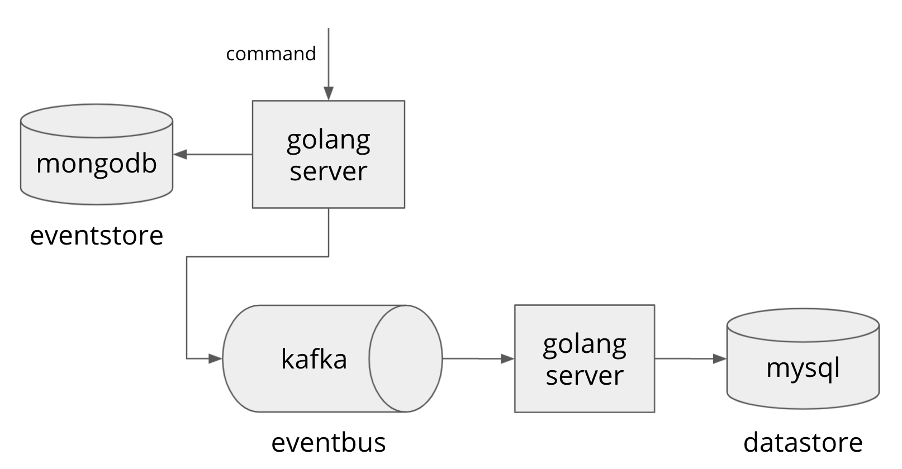

# go-eventsource

## command request
<p align="center">
  </img>
</p>

## query request
<p align="center">
  </img>
</p>

## run

```bash
$ go run cmd/server/main.go
```

client 생성
```bash
$ curl -XPOST localhost:8080/clients \
  -H 'Content-Type: application/json' \
  -d '{"name":"steve", "email":"steve@gmail.com"}'
{"id":"dc5dba8b-a650-4cb0-8ee6-ae00536108a1","name":"steve","email":"steve@gmail.com"}
```

client 이름 수정
```bash
$ curl -XPUT localhost:8080/clients/dc5dba8b-a650-4cb0-8ee6-ae00536108a1 \
  -H 'Content-Type: application/json' \
  -d '{"name":"Steve", "email":"steve@gmail.com"}'
{"id":"dc5dba8b-a650-4cb0-8ee6-ae00536108a1","name":"Steve","email":"steve@gmail.com"}
```

client 조회
```bash
$ curl -XGET localhost:8080/clients/dc5dba8b-a650-4cb0-8ee6-ae00536108a1
{"id":"dc5dba8b-a650-4cb0-8ee6-ae00536108a1","name":"Steve","email":"steve@gmail.com"}
```
